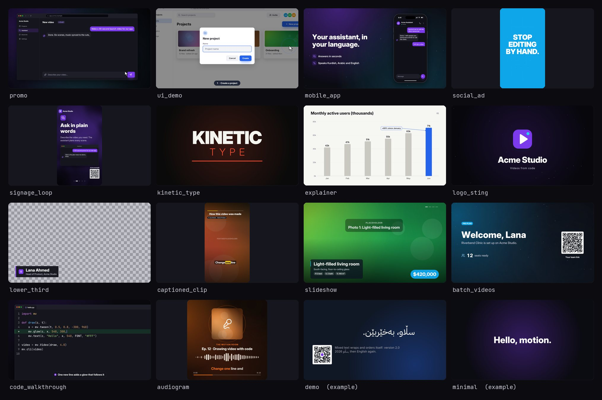

# Programmatic Motion Video

An agent skill and a Python engine for making motion-graphics videos in code: product promos, UI and
app demos, explainers, social ads, trade-show loops, captioned clips, logo stings and more. Skia draws
every frame, ffmpeg encodes, and the soundtrack (music, interface sounds, loudness) is synthesised on
the same timeline.

It works with Claude (the apps and Claude Code), OpenAI Codex, Gemini CLI, Cursor, GitHub Copilot,
Windsurf, OpenCode, and any agent that can run Python. The agent imports a tested engine and starts
from a template instead of writing a renderer, so a new video is mostly copy, colours and timings.



## What you get

- **Engine** (`engine/`): twelve modules the agent imports, never rewrites. Timing and easing,
  scenes and transitions, parallel rendering with resume, fonts by name, Arabic-script and other
  complex text, UI mockups, charts, captions, code editors, 1,854 icons, brand kits from CSS, music
  and sound effects.
- **Templates** (`templates/`): fourteen complete, tested videos to start from.
- **Tools** (`tools/`): environment check, project scaffolding, Google Fonts download, icon search,
  exports (GIF, WebP, rotated, USB-player fallback, poster, loops, WebM), colour-tag repair.
- **Assets** (`assets/`): open-licensed fonts (Inter, JetBrains Mono, Space Grotesk, Instrument Serif,
  IBM Plex Sans Arabic), the Lucide icons, a sample logo, brand kit, CSV and captions.
- **Knowledge** (`SKILL.md`, `references/`): how to plan, time, check and deliver a video, which the
  agent reads only when a task needs it.

No video framework is involved: only libraries (skia-python, numpy, scipy, Pillow, HarfBuzz, segno)
and ffmpeg.

## Install

```bash
npx skills add PawanOsman/programmatic-motion-video
```

The [skills CLI](https://skills.sh) finds the agents on your machine (Claude Code, Codex, Gemini CLI,
Cursor, Copilot, Windsurf, OpenCode and more) and installs the skill for them. Restart your agent
afterwards so it loads the skill.

You also need **Python 3.9 or newer** and **ffmpeg** (with libx264). The skills CLI copies only the
skill files, so the first time the skill runs the agent checks the machine with
`tools/check_env.py` and installs the Python packages from `requirements.txt`. To do that yourself
up front, see [Check the setup](#check-the-setup).

### With the install script

To install the skill and its dependencies in one go, or for more control over where it goes:

macOS and Linux:

```bash
git clone https://github.com/PawanOsman/programmatic-motion-video.git
cd programmatic-motion-video
./install.sh
```

Windows (PowerShell):

```powershell
git clone https://github.com/PawanOsman/programmatic-motion-video.git
cd programmatic-motion-video
powershell -ExecutionPolicy Bypass -File .\install.ps1
```

The script copies the skill into the skills folders of the agents it finds, installs the Python
packages from `requirements.txt`, checks ffmpeg and prints a readiness report.

| Option (`install.sh` / `install.ps1`) | Does |
|---|---|
| `--agent all` / `-Agent all` | Installs to both `~/.claude/skills` and `~/.agents/skills` |
| `--agent codex` / `-Agent codex` | One agent: `claude`, `codex`, `gemini`, `cursor`, `copilot`, `opencode`, `windsurf` |
| `--project DIR` / `-Project DIR` | Into one project (`.claude/skills`, `.agents/skills`) instead of your home folder |
| `--dest DIR` / `-Dest DIR` | Into any other skills folder |
| `--link` / `-Link` | A link to this folder instead of a copy (to edit the skill in place) |
| `--optional` / `-Optional` | Also the optional packages (QR decoding, PDF artwork, highlighting, web capture) |
| `--system-deps` / `-SystemDeps` | Also installs ffmpeg with apt, dnf, pacman, zypper, Homebrew or winget |
| `--no-deps`, `--deps-only` / `-NoDeps`, `-DepsOnly` | Only the skill files, or only the packages |
| `--uninstall` / `-Uninstall` | Removes the installed copies |

### Claude apps (web and desktop)

1. Build the zip with `python tools/package_skill.py` (or download it from the
   [releases](https://github.com/PawanOsman/programmatic-motion-video/releases)) and keep it as it is (the skill folder
   is at its root).
2. In Claude, open **Customize → Skills**, add a skill and upload the zip.
3. Code execution must be on. The first time the skill runs, Claude installs the Python packages in
   its sandbox, which needs network access to PyPI; if your organisation restricts the sandbox's
   network, an admin can allow package registries.

### By hand

`~/.agents/skills` is the shared Agent Skills folder, and every agent below reads it. To place the
folder yourself:

| Agent | Your home folder (all projects) | One project |
|---|---|---|
| OpenAI Codex | `~/.agents/skills/` | `.agents/skills/` |
| Gemini CLI | `~/.gemini/skills/` or `~/.agents/skills/` | `.gemini/skills/` or `.agents/skills/` |
| Cursor | `~/.cursor/skills/` or `~/.agents/skills/` | `.cursor/skills/` or `.agents/skills/` |
| GitHub Copilot (VS Code) | `~/.copilot/skills/`, `~/.agents/skills/` or `~/.claude/skills/` | `.github/skills/`, `.agents/skills/` or `.claude/skills/` |
| Claude Code | `~/.claude/skills/` | `.claude/skills/` |
| Windsurf | `~/.codeium/windsurf/skills/` or `~/.agents/skills/` | `.windsurf/skills/` or `.agents/skills/` |
| OpenCode | `~/.config/opencode/skills/`, `~/.agents/skills/` or `~/.claude/skills/` | `.opencode/skills/`, `.agents/skills/` or `.claude/skills/` |

Each location holds the whole folder: `~/.agents/skills/programmatic-motion-video/SKILL.md`. Then
install the packages: `pip install -r requirements.txt`.

### Any other agent or chat

Put the folder where the agent can read it and tell it: *"Read programmatic-motion-video/SKILL.md
and follow it to make the video."* In a chat without code execution, the model can still write the
project; you run the commands it gives you.

The Claude API's skill container is not supported: it has no network access, so skia-python cannot
be installed there.

### Check the setup

```bash
python tools/check_env.py
```

It lists what is installed and prints the exact commands for anything missing. On Linux, skia-python
also needs the system GL libraries (`sudo apt-get install -y libgl1 libegl1` on Debian and Ubuntu).

## Use it

Ask your agent for a video in plain words, with whatever material you have:

- "Make a 30-second promo for our app from lumo.example, 1080p and a vertical version, with music."
- "Our expo screen is a 27-inch monitor turned portrait. Make a silent 60-second loop with a QR code to
  our site."
- "Turn this CSV into one short welcome video per customer."
- "Add karaoke captions to this clip from its SRT file."
- "Animate the attached SVG logo as a 5-second sting with a transparent background."
- "Explain these quarterly numbers in a 40-second data video."

The agent checks the machine, scaffolds a project from the closest template, fills in your content,
reviews contact sheets of stills, renders in parallel, and verifies the file (decode, colour tags,
loudness, QR codes, loop seams) before handing it over.

### Without an agent

```bash
python tools/new_project.py my-video --template promo      # --list shows every template
cd my-video
python main.py sheet                     # contact sheet of 12 moments: sheet.png
python main.py still 4.2 frame.png       # one frame at full size
python main.py render out.mp4            # parallel, resumable, with sound
MV_SIZE=1080x1920 python main.py render vertical.mp4
```

Edit `CONFIG` at the top of `main.py` (copy, colours, timings, logo, data), look at a sheet, repeat.
The smallest complete video:

```python
import mv
from mv import *

W, H = 1920, 1080

def draw(c, t):                                      # every frame is a function of time
    c.clear(color('#0B0B12'))
    glow(c, W / 2, H / 2, 800, '#7C3AED', 0.35)
    x = tween(t, 0.3, 0.8, -500, W / 2, out_expo)    # slides in between 0.3 s and 1.1 s
    a = presence(t, 0.3, 3.6)                        # fades in, and out by 3.6 s
    text(c, 'Hello, motion.', x, H / 2, font('Inter', 120, wght=800), '#FFFFFF', a, align='center')

video = Video(draw, 4.0, (W, H), 30)

if __name__ == '__main__':
    mv.cli(video)
```

## Templates

| Template | Makes | Sizes |
|---|---|---|
| `promo` | 30 s product promo: logo intro, hook, live product demo, features, numbers, call to action with QR | 16:9, 9:16, 1:1, 4K |
| `ui_demo` | Desktop app walkthrough: pointer, modal, typing, loading, toasts, camera moves, step captions | 16:9 |
| `mobile_app` | Phone demo: chat with a streamed answer, a message in Kurdish, a notification, feature points | 16:9, 9:16 |
| `social_ad` | 15 s vertical ad: hook, phone product shot, benefits, proof, call to action; social safe areas | 9:16 |
| `signage_loop` | Silent seamless loop for an expo screen: live mini demos, a persistent QR code, progress dots | 9:16 (1440x2560), 16:9 |
| `kinetic_type` | Kinetic typography on a 120 BPM grid: punches, masks, weight waves, decoding, rotating words | 16:9 |
| `explainer` | Data story: emphasised bars with a callout, lines, a donut, KPI tiles, a takeaway with its source | 16:9, 9:16 |
| `logo_sting` | 5 s logo reveal: outlines draw on, the fill lands on the hit, a shine, sparkles, the name | 16:9, optional alpha |
| `lower_third` | Name and title for editors, rendered with transparency (ProRes 4444 or VP9) | 16:9 with alpha |
| `captioned_clip` | Footage (or a placeholder) with word-timed captions from SRT, VTT or Whisper JSON | 9:16, 16:9 |
| `slideshow` | Photos with Ken Burns moves, info cards, badges, a price and a contact card with QR | 16:9, 9:16 |
| `batch_videos` | One personalised video per CSV row, validated first, rendered in parallel | 16:9 |
| `code_walkthrough` | Typed, highlighted code, a spotlighted line, an edit typed in as a diff, a terminal run | 16:9 |
| `audiogram` | Podcast or music clip: cover, a live spectrum from the audio, captions, progress | 1:1, 9:16 |

`examples/demo.py` is a compact two-scene reference and `examples/minimal.py` the smallest video;
both work as templates too (`--template minimal`).

## The engine

| Module | Gives you |
|---|---|
| `mv` | time and easing, colour (OKLab mixing), shapes and SVG paths, path trimming and morphing, layers and clips, fonts by name with variable axes, text and wrapping, shaping for complex scripts, images and SVG, QR codes, camera, pointer, scenes, timeline, transitions, rendering, checks, the command line |
| `sfx` | music beds in five styles (ambient, pulse, drive, corporate, lofi), instruments and chords, UI sounds (clicks, whooshes, risers, impacts, chimes), a mixer with buses, ducking and seamless loops, two-pass loudness normalisation, audio analysis |
| `ui` | light and dark themes (or from a brand), browser windows, phones and laptops, buttons, fields, toggles, sliders, tabs, menus, chat with streamed answers, tables, cards, toasts, modals, tooltips, steppers, callouts |
| `fx` | mesh and shader backgrounds, grids, floors, particles, bokeh, starfields, waves, confetti, sparkles, shine, glass, spotlights, logo reveals, grain |
| `kinetic` | text reveals in ten styles, right-to-left reveals, fitted statements, decoding text, counters and odometers, rotating words, highlights, underlines, hand-drawn circles, weight waves, tickers |
| `charts` | colour-blind-safe bars, lines, donuts, KPI tiles, sparklines, meters, rings and heatmaps that animate in |
| `captions` | SRT, VTT and Whisper JSON; karaoke, box, pop, word and plain styles; RTL |
| `codeview` | a code editor that types, highlights and shows diffs; a terminal that runs a session |
| `icons` | 1,854 Lucide icons by name, searchable, drawn on stroke by stroke |
| `brand` | brand kits from CSS tokens (shadcn, Tailwind, oklch) or brand.json; tints, contrast checks |
| `layout` | size presets, safe areas, a resolution-independent unit, grids and splits |
| `media` | footage frames through ffmpeg, image sequences, placeholder images, web page captures |

Every signature is in [`references/api.md`](references/api.md).

## Command line

Every project script (and every template) takes the same commands:

| Command | Does |
|---|---|
| `python main.py info` | Duration, size, fps and scene start times |
| `python main.py sheet [t1,t2,...] [out.png]` | A contact sheet of stills |
| `python main.py still t [out.png]` | One full-size frame |
| `python main.py bench` | Milliseconds per frame and a render-time estimate |
| `python main.py render out.mp4` | Parallel, resumable render with sound. `--codec h264 \| h264-444 \| hevc \| av1 \| prores \| prores4444 \| vp9 \| vp9-alpha`, `--scale 0.5`, `--start`/`--end`, `--workers`, `--crf`, `--preset`, `--no-audio` |
| `python main.py frames folder` | A PNG sequence (with alpha when transparent) |
| `python main.py seam` | Loop seam compared with a normal frame step |
| `python main.py qr t` | Decodes the QR codes visible at time t |
| `python main.py probe out.mp4` | Stream facts and a full decode test |

`MV_SIZE=1080x1920` and `MV_FPS=60` (or `30000/1001`) change the format without editing the script.

## Tools

| Tool | Does |
|---|---|
| `tools/check_env.py` | Checks packages, ffmpeg encoders, fonts and icons; prints install commands |
| `tools/new_project.py` | Scaffolds a self-contained project from a template |
| `tools/fetch_fonts.py` | Downloads Google Fonts families by name into `./fonts` |
| `tools/find_icons.py` | Searches the icons and renders contact sheets of them |
| `tools/export.py` | GIF, WebP, rotated video, USB-player fallback, poster, repeated loop, social, WebM |
| `tools/fix_colors.py` | Checks or repairs the colour tags of existing videos |
| `tools/gen_api.py` | Regenerates `references/api.md` from the engine |
| `tools/package_skill.py` | Validates the skill and builds the zip |

## How it works

- **A video is a function of time.** `draw(c, t)` paints the frame at `t` on a Skia canvas and keeps
  no state between frames. Any frame can be drawn alone (instant previews), frames can be drawn in any
  order and in parallel, and loops close exactly.
- **Rendering** splits the frames into chunks, renders them in separate processes, pipes raw RGBA
  frames into ffmpeg, joins the chunks without re-encoding and adds the sound. Finished chunks are
  kept, so an interrupted render resumes. Frames are converted with the BT.709 matrix and tagged, so
  colours match across players.
- **Text** uses real font files with variable axes, HarfBuzz shaping and Skia's paragraph engine,
  so Kurdish, Arabic, Persian, Hebrew and Indic scripts join and order correctly next to English.
- **Sound** is synthesised with numpy on the same clock as the picture (every cut, click and pop has
  its cue), mixed on buses and normalised to a loudness target such as -14 LUFS.
- **Checks** are built in: contact sheets, QR decoding, loop seams, full decode tests, loudness.

## Repository layout

```
programmatic-motion-video/
├── SKILL.md                 the skill: what the agent reads first
├── README.md                this file
├── install.sh, install.ps1  installers
├── requirements.txt         Python packages (requirements-optional.txt for extras)
├── engine/                  mv, sfx, ui, fx, kinetic, charts, captions, codeview, icons, brand, layout, media
├── templates/               14 starting points
├── examples/                demo.py, minimal.py
├── tools/                   check_env, new_project, fetch_fonts, find_icons, export, fix_colors, gen_api, package_skill
├── references/              API reference and guides the agent reads when needed
├── assets/                  fonts (with licences), icons, samples
├── tests/                   engine and template tests
├── docs/                    the gallery image
└── .github/workflows/       continuous integration
```

## Tests

```bash
python tests/run_tests.py               # engine tests, about a minute
python tests/run_tests.py --templates   # also runs, sheets and renders every template (several minutes)
```

On GitHub, `.github/workflows/tests.yml` runs the engine tests on every push; start it by hand with
the templates option to render every template too.

## Updating

Replace the folder (or run the install script from the new version); projects made earlier keep their
own copy of the engine, so they keep rendering the same way. To bring a project up to date, copy the
newer `engine/*.py` files next to its `main.py`.

## Troubleshooting

| Problem | Fix |
|---|---|
| `libEGL.so.1` or `libGL.so.1` not found when importing skia | `sudo apt-get install -y libgl1 libegl1` (Fedora: `mesa-libGL mesa-libEGL`) |
| `externally-managed-environment` from pip | Use a virtualenv, or `pip install --user --break-system-packages -r requirements.txt` (the install script does this for you) |
| ffmpeg has no `libx264` | Install a full build: `apt-get install ffmpeg`, `brew install ffmpeg`, `winget install Gyan.FFmpeg`; on Fedora enable RPM Fusion |
| A font name is not found | `python tools/fetch_fonts.py "Family Name"`, or put the font files in `./fonts` |
| `python main.py qr` fails | Install the zbar library (`apt-get install libzbar0`, `brew install zbar`) and `pip install pyzbar` |
| A render stops when the agent's command times out | Run it detached (`references/performance.md`); running the same command again resumes |

## Licence

The code and documentation are MIT licensed (`LICENSE`). The bundled fonts are under the SIL Open
Font License 1.1 and the icons under the ISC licence (with MIT for the Feather-derived ones); details
in `THIRD_PARTY_NOTICES.md`. Videos you make are yours. Sample names, companies and figures in
`assets/sample/` are fictional.
